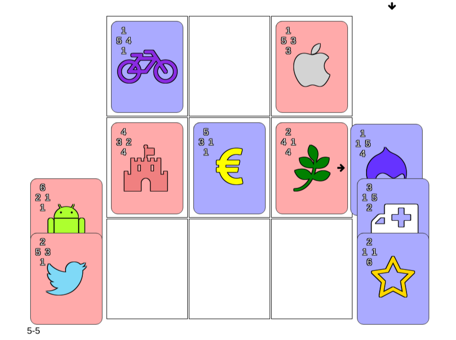

# Triad x3

Poor-mans version of Triple Triad from FF VIII.
http://finalfantasy.wikia.com/wiki/Triple_Triad

# Triad TODO

https://bitbucket.org/david_martin_fh/triad-x3/issues?status=new&status=open

# Matches TODO

- [ ] Player names
- [ ] Player colour selection
- [ ] Success fade out & scale css
- [ ] Player colour win message
- [ ] Grid size selector
- [ ] Ipad Safari support
- [ ] keyboard support
- [ ] Statistics report on finish
- [ ] special cards e.g. flip all for 2 seconds, show all recently flipped
- [ ] Add more cards
- [ ] Allow custom card styles
- [ ] Start new game when finished
- [ ] Players 2-4
- [ ] Time attack 1 player
- [ ] Time attack high score
- [ ] Remote multiplayer
- [ ] Remember player on refresh